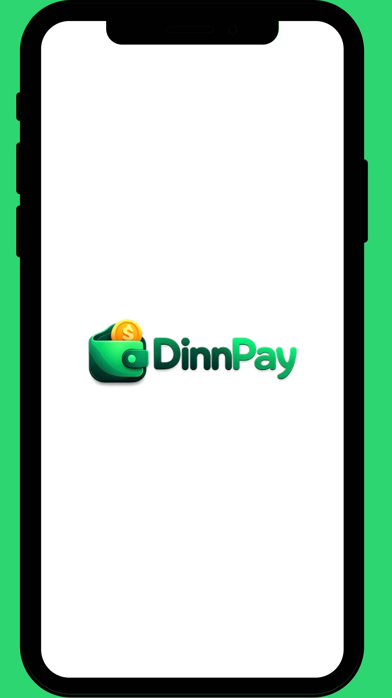
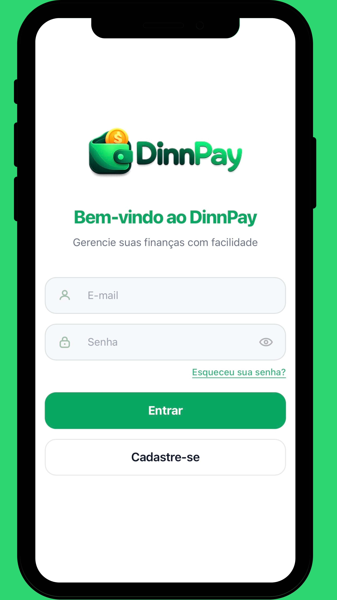
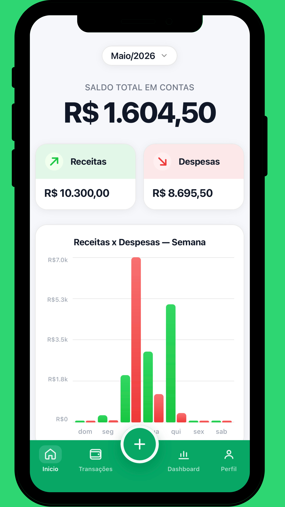
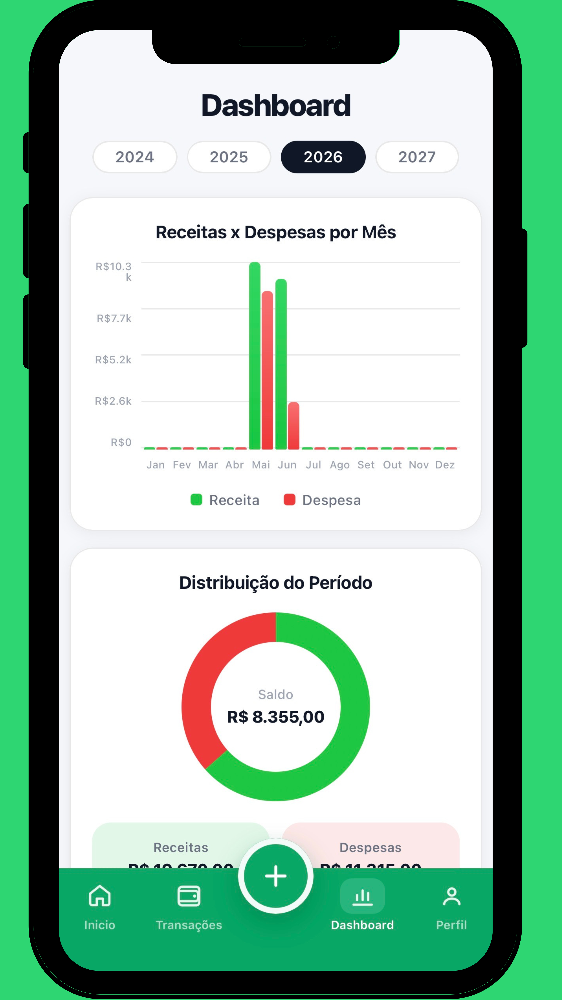
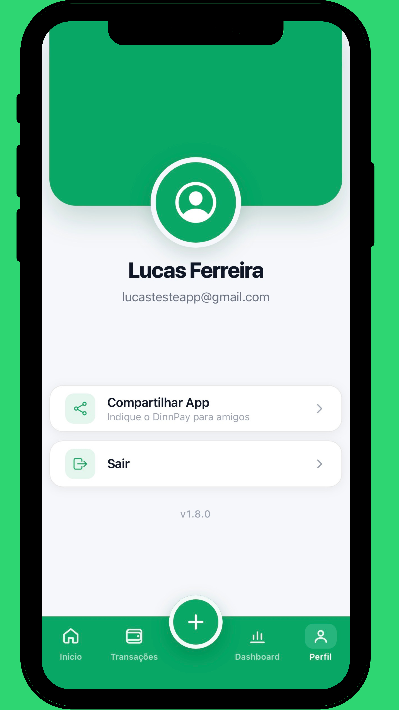

<p align="center">
  
</p>

# DinnPay

O DinnPay é um aplicativo de controle financeiro pessoal desenvolvido para ajudar usuários a organizarem suas finanças de forma simples e prática. Através dele, é possível registrar receitas e despesas, acompanhar transações, visualizar indicadores financeiros em um dashboard e gerar relatórios para um melhor controle dos gastos.

Acesse o app pelo link: **[app-dinnpay.web.app](https://app-dinnpay.web.app)**

---

## 📱 Telas

<table>
  <tr>
    <td align="center"><b>Splash</b><br></td>
    <td align="center"><b>Login</b><br></td>
    <td align="center"><b>Recuperar Senha</b><br></td>
  </tr>
  <tr>
    <td align="center"><b>Criar Conta</b><br></td>
    <td align="center"><b>Início</b><br></td>
    <td align="center"><b>Transações</b><br></td>
  </tr>
  <tr>
    <td align="center"><b>Adicionar Transação</b><br></td>
    <td align="center"><b>Dashboard</b><br></td>
    <td align="center"><b>Exportar Extrato</b><br></td>
  </tr>
  <tr>
    <td align="center"><b>Perfil</b><br></td>
    <td></td>
    <td></td>
  </tr>
</table>

## ✨ Funcionalidades

- **Autenticação** — cadastro e login com e-mail/senha (Firebase Auth), recuperação de senha e expiração automática de sessão por inatividade.
- **Início** — saldo total, receitas e despesas do mês selecionado, gráfico de movimentação semanal e filtro por mês/ano.
- **Transações** — lista de receitas e despesas agrupada por data, com filtro por tipo (todas / receitas / despesas) e por mês/ano; criação, edição e exclusão de lançamentos.
- **Dashboard** — visão anual com evolução mensal de receitas e despesas em gráfico, saldo acumulado e percentual de receita.
- **Exportar extrato** — geração de extrato em **PDF** ou **CSV** por período e tipo de transação, com compartilhamento nativo (Android) ou Web Share API / download (navegador).
- **Perfil** — dados do usuário, compartilhar o app, logout e número da versão instalada.
- **PWA** — instalável na tela inicial (manifest + ícones para todos os tamanhos), funciona offline para a interface já carregada.
- **App nativo Android** — empacotado via Capacitor, com integração nativa de compartilhamento de arquivos e ciclo de vida do app (atualiza dados ao voltar do background).

## 🛠️ Tecnologias

- [Angular 20](https://angular.dev/) (standalone components, `OnPush` change detection, novo template syntax `@if`/`@for`)
- [Ionic 8](https://ionicframework.com/) — componentes e estrutura mobile-first
- [Capacitor 8](https://capacitorjs.com/) — empacotamento nativo Android
- [Firebase](https://firebase.google.com/) — Auth + Firestore (via `@angular/fire`)
- [RxJS](https://rxjs.dev/) — fluxos reativos de dados
- [jsPDF](https://github.com/parallax/jsPDF) — geração do extrato em PDF
- TypeScript, HTML, CSS, SCSS

## 🚀 Como rodar localmente

### Pré-requisitos

- Node.js 20+
- Uma conta/projeto no [Firebase](https://console.firebase.google.com/) com **Authentication** (e-mail/senha) e **Firestore** habilitados

### Passo a passo

```bash
# 1. Clonar o repositório
git clone https://github.com/<seu-usuario>/dinnPay-app.git
cd dinnPay-app

# 2. Instalar dependências
npm install
```

3. Configure o Firebase: copie `src/environments/environment.example.ts` para `src/environments/environment.ts` e `src/environments/environment.prod.example.ts` para `src/environments/environment.prod.ts`, e preencha os dois com as credenciais do seu projeto Firebase (Configurações do projeto → Geral → Seus apps → SDK do Firebase).
4. Publique as regras de segurança do Firestore (já incluídas no repositório):

```bash
firebase deploy --only firestore:rules
```

5. Rode o app:

```bash
npm start          # ng serve — http://localhost:4200
```

### Build para produção (Web)

```bash
npm run build
```

### Build do app Android nativo

```bash
npx cap sync android
npx cap open android   # abre no Android Studio
```

> Requer JDK 21 instalado (exigência do `@capacitor/android`).

## 🔒 Segurança

O acesso aos dados é controlado pelas [regras do Firestore](firestore.rules): cada usuário só lê/escreve os próprios documentos (`usuario/{uid}` e suas `transacoes`), com validação de tipos, tamanhos e campos permitidos em cada operação.

> Este repositório **não inclui** as credenciais reais de nenhum projeto Firebase (`src/environments/environment.ts` e `environment.prod.ts` são ignorados pelo Git). Para rodar o app, configure seu próprio projeto Firebase conforme o passo 3 acima.

## 📄 Licença

Projeto acadêmico desenvolvido para a disciplina de Desenvolvimento Mobile — FUMEC.
